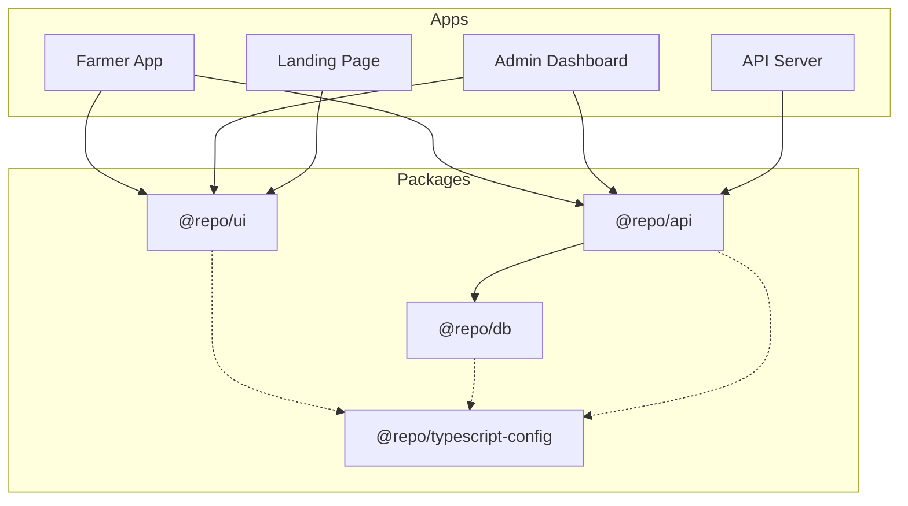

# Cropia: AI-Powered Early Crop Health Detection System

**Cropia** is an intelligent agricultural platform designed to bridge the gap between farmers and administrative bodies. It empowers farmers with real-time, offline-first disease detection and decision support, while providing government officials and NGOs with a "God View" of regional crop health to prevent outbreaks.

Built as a high-performance monorepo using **Turborepo**, **Bun**, and **Hono**, Cropia leverages Google's **Gemini 2.5 Flash Lite** for speed and accuracy in low-resource environments.

---

## 🌐 Live Demos

- **Landing Page:** [https://cropia-phi.vercel.app/](https://cropia-phi.vercel.app/)
- **Admin Dashboard (Government/NGO):** [https://cropia-admin.vercel.app](https://cropia-admin.vercel.app)
- **Farmer App:** [https://cropia-farmer.vercel.app](https://cropia-farmer.vercel.app)

---

## 🚀 Key Features

### 👨‍🌾 For Farmers (The Field App)

- **AI Crop Scanner ("The Gatekeeper"):**
- Instantly validates if an image is a crop (filtering out selfies/documents).
- Detects diseases, pests, and nutrient deficiencies in real-time.
- Provides a "Confidence Score" and "Visual Severity" rating (Healthy vs. Warning vs. Critical).

- **Decision Support Dashboard:**
- **Smart Spray Planner:** A 12-hour timeline analyzing **Wind Speed (<15km/h)** and **Rain Probability (<30%)** to recommend safe spraying windows.
- **Root Health X-Ray:** Visualizes soil moisture at two depths (**Surface 0-10cm** vs. **Deep 10-30cm**) to detect "false dryness" and prevent over-irrigation.
- **Water Balance Calculator:** Tracks net water deficit (`Rain - Evapotranspiration`) over the last 3 days.

- **Cropia Assistant:** A conversational AI chatbot that can answer questions about recent scans, weather forecasts, and agronomy advice.

### 🏢 For Admin/Government ("The Watchtower")

- **The God View (Live Map):**
- Interactive geospatial map visualizing every crop scan in the jurisdiction.
- Color-coded markers (Green=Healthy, Red=Critical) for spotting regional outbreaks.

- **Regional Analysis Agent:**
- Aggregates data from thousands of scans to generate "News Headlines" (e.g., _"Sugarcane Rust cases up 40% in Kolhapur"_).
- Provides statistical breakdowns of disease distribution per district/taluka.

- **Jurisdiction Control:** Granular RBAC allowing officials to view data specifically for their State, District, or Taluka.

## 🛠 Tech Stack

**Core Infrastructure**

- **Monorepo:** [Turborepo](https://turbo.build/)
- **Runtime/Manager:** [Bun](https://bun.sh/) (v1.2.20)
- **Dependency Management:**
  - **Catalog:** Centralized versions in root `package.json`.
  - **Peer Dependencies:** Preventing React duplication in shared UI packages.
- **Language:** TypeScript (v5.9)

**Frontend (Web & PWA)**

- **Framework:** React (Vite)
- **Marketing Site:** [Astro](https://astro.build/) (Static/Zero-JS)
- **Styling:** Tailwind CSS + Shadcn UI (`@repo/ui`)
- **State/Routing:** TanStack Query + TanStack Router
- **Maps:** Mapbox / Leaflet (via React)

**Why Astro for Landing Page?**
We chose Astro over Next.js/React for the public site to ensure **maximum performance**:
- **Zero JS Runtime:** Ships pure HTML/CSS by default.
- **No Overhead:** Avoids the ~30kb React hydration cost for static pages.
- **Islands Architecture:** Interactive components (React) are only loaded when needed.

**Backend (API & Edge)**

- **Framework:** [Hono](https://hono.dev/) (Lightweight, Edge-ready)
- **Communication:** Hono RPC (Type-safe client-server contract)
- **Database:** MongoDB (via Prisma ORM)
- **Auth:** BetterAuth (Multi-tenant Organization support)

**Artificial Intelligence**

- **Vision Model:** Google **Gemini 2.5 Flash Lite** (Optimized for low latency).
- **Framework:** Vercel AI SDK (`@ai-sdk/google`).
- **Agents:**

1. **Gatekeeper Agent:** Validates image integrity and diagnoses specific crop issues.
2. **Analysis Agent:** Summarizes regional data into actionable natural language insights.

---

## 🏗 Architecture & Repository Structure

The project follows a modern monorepo structure:

```text
.
├── apps
│   ├── farmer       # The Farmer PWA (Vite + React)
│   ├── admin        # The Government Dashboard (Vite + React)
│   ├── landing-page # Marketing Website (Astro)
│   └── api          # Hono Backend (Business Logic + AI Agents)
├── packages
│   ├── db           # Prisma Schema & MongoDB Client
│   ├── ui           # Shared Shadcn UI Components
│   ├── config       # Shared TS/Eslint Configs
│   └── scripts      # Utility scripts
└── turbo.json       # Build pipeline configuration
```

### Dependency Graph



### The AI Pipeline

Cropia uses a **Conditional Agentic Workflow**:

1. **Input:** Image uploaded by farmer.
2. **Gatekeeper (Gemini 2.5 Flash Lite):**

- _Check:_ Is this a plant? (Reject if false).
- _Analyze:_ Identify Crop -> Detect Issue -> Assess Severity.
- _Label:_ Generate semantic filename (e.g., `sugarcane_rust_timestamp`).

3. **Persistence:** Data stored in MongoDB with a "Location Snapshot" (State/District/Village frozen at upload time) for fast geospatial queries.
4. **Async Analysis:** The "Analysis Agent" runs periodically to aggregate these snapshots into regional reports for the Admin.

---

## 💾 Database Schema (Key Highlights)

- **User/Auth:** Uses `BetterAuth` with `Organization` and `Member` tables for managing Co-ops and Government hierarchies.
- **Scan Model:** Stores the `imageUrl`, `aiMetadata` (diagnosis, confidence), and a **Location Snapshot** (`state`, `district`, `taluka`) to avoid expensive joins during analytics.
- **Jurisdiction Type:** A custom composite type defining an admin's scope (e.g., `{ state: "Maharashtra", district: "Kolhapur" }`).

---

## 🚀 Getting Started

### Prerequisites

- **Bun** (v1.0+)
- **MongoDB** (Local or Atlas URL)
- **Cloudinary Account** (for image storage)
- **Google Gemini API Key**

### Installation

1. **Clone the repository:**

```bash
git clone https://github.com/your-username/cropia.git
cd cropia

```

2. **Install dependencies:**

```bash
bun install

```

3. **Environment Setup:**
   Create a `.env` file in the root (see `.env.example`):

```env
DATABASE_URL="mongodb+srv://..."
GOOGLE_GENERATIVE_AI_API_KEY="AIzaSy..."
CLOUDINARY_CLOUD_NAME="..."
BETTER_AUTH_SECRET="..."

```

4. **Database Push:**

```bash
bun run db:push

```

5. **Run Development Server:**

```bash
bun run dev

```

- Landing Page: `http://localhost:4321`
- Farmer App: `http://localhost:5173`
- Admin App: `http://localhost:5174`
- Backend API: `http://localhost:3000`

---

## 🤝 Contributing

1. Fork the repo.
2. Create your feature branch (`git checkout -b feature/amazing-feature`).
3. Commit your changes (`git commit -m 'Add amazing feature'`).
4. Push to the branch (`git push origin feature/amazing-feature`).
5. Open a Pull Request.

---

## 📄 License

Distributed under the MIT License. See `LICENSE` for more information.
