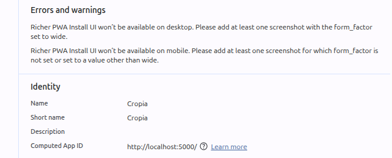

- Add the show icon fof the password field in the login page and signup page
- The google save password feature should remember the email and password ( currently it saves the name and password )
- add the theme toggle button in the setting page
- Richer PWA are not available on the desktop 
- MOving all usable Components into the ui package even for maps and other things

##  Adding Guest login features 
for the project 
- the user can easily able to view the user experience and ui in better way.